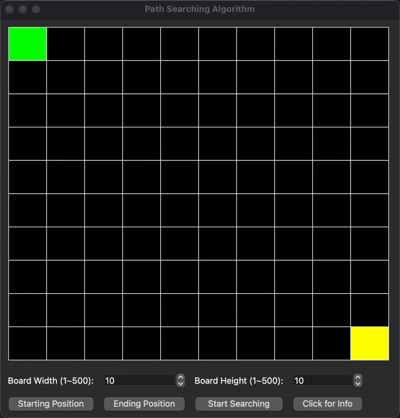

# Path Searching Algorithm and Visualization

## Features:
- Simluated GPS path searching process in real time. The algorithm can generate and highlight the shortest path in a graph.
- Utilized different data structures to optimize efficiency of the projectand to reduced extra memeory accesses.
- Implemented GUI for a better user experience.

## Project Details:
- Implemented A* path searching algorithm in C++ with the help of Qt Library to build GUI.
- Visualized both potential and shortest paths in a customized graph.
- Allowed users to resize the window and to manipulate with different starting positions, ending positions, obstacles quantities, and graph sizes.

